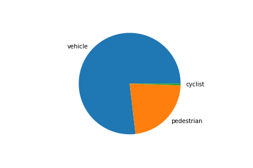

# Data
## Download tfrecords
In first step I modified `download_process.py` to ignore files which were downloaded earlier.

## Exploratory Data Analysis and Split Creation
### Data analys
Let's take a look at 10 random frames.


We have frames day and night. Some have pedestrians, some have cars. But no cyclist.

Take look at the distribution of objects. 



### Create the splits
Create cross validation split from  download tfrecords. 
To save disk space I created soft link in [script]('create_splits.py') .

## Training
### Train on base parameters.
When I execute train scripts I had some problems. 
* Out of memory. To avoid this problem batch_size was decreased to 3. 
* TypeError in evaluation step. 
This problem was fixed when `metrics_set` was changed by `pascal_voc_detection_metrics`. 
[Link to knowledge forum.](https://knowledge.udacity.com/questions/657618) 

```
 PascalBoxes_Precision/mAP@0.5IOU: 0.046190
 PascalBoxes_PerformanceByCategory/AP@0.5IOU/vehicle: 0.060793
 PascalBoxes_PerformanceByCategory/AP@0.5IOU/pedestrian: 0.031586
 PascalBoxes_PerformanceByCategory/AP@0.5IOU/cyclist: nan
 Loss/localization_loss: 0.473013
 Loss/classification_loss: 0.378682
 Loss/regularization_loss: 0.518820
 Loss/total_loss: 1.370515
 ```


Let use this result as started. 

`Note`. Cyclists not detected.


### Modifications.
#### Resnet101.
In first attempt I change `feature_extractor` from `resnet50` to `resnet101` in [pipeline](training/reference_resnet101/pipeline_new.config).
Unfortunately this method use more memory. 
`batch_size` was decreased to 2   

Final result was worse than with `resnet50`. mAP was smaller, losses is higher. Cyclist still not detected.


|Metric|reference|reference_resnet101|
|---|---|---|
|mAP@0.5IOU|0.057651|0.000043|
|vehicle|0.069979|0.000086|
|pedestrian|0.045324|0.000001|
|cyclist|nan|nan|
|localization_loss|0.357283|0.870137|
|classification_loss|0.303982|2284.230713|
|regularization_loss|0.857036|96233312112082944.000000|
|total_loss|1.518301|96233312112082944.000000|

#### Chose augmentations
Let chose which augmentations are usefully.
On [github](https://github.com/tensorflow/models/blob/master/research/object_detection/configs/tf2/centernet_resnet50_v1_fpn_512x512_kpts_coco17_tpu-8.config)
I found 4 additional augmentations. Let compare them. 

After 5000 steps I get this results.


|Metric|base|brightness|contrast|hue|saturation|
|---|---|---|---|---|---|
|mAP@0.5IOU|0.022741|0.004134|0.004600|0.013497|0.088740|
|vehicle|0.040212|0.008268|0.009200|0.026993|0.085034|
|pedestrian|0.005270|0.000000|0.000000|0.000000|0.092446|
|cyclist|nan|nan|nan|nan|nan|
|localization_loss|0.471098|0.527493|0.634102|0.520275|0.311701|
|classification_loss|0.400740|0.573891|0.546065|0.456895|0.246451|
|regularization_loss|0.931825|0.476191|19.680801|1.119948|0.250153|
|total_loss|1.803663|1.577576|20.860970|2.097117|0.808306|

Pipelines with hue, brightness and saturation were found to be more effective. Pipelines with contrast do not look like useful.

#### Train with augmentations
I add to base [pipeline](training/reference_aug/pipeline_new.config) two augmentation:
* random_adjust_hue
* random_adjust_contrast


|Metric|reference|reference_aug|
|---|---|---|
|mAP@0.5IOU|0.046190|0.053005|
|vehicle|0.060793|0.066437|
|pedestrian|0.031586|0.039574|
|cyclist|nan|nan|
|localization_loss|0.473013|0.466569|
|classification_loss|0.378682|0.346981|
|regularization_loss|0.518820|0.393930|
|total_loss|1.370515|1.207480|

### Known issues
* Small memory on gpu.
* Metrics_set


### Improvements suggestions.
* Compare with another feature_extractor.
* Use more powerful hardware. (Ten hours per full pipeline iteration is very slow).
* Use another augmentations.
* Use bigger dataset.