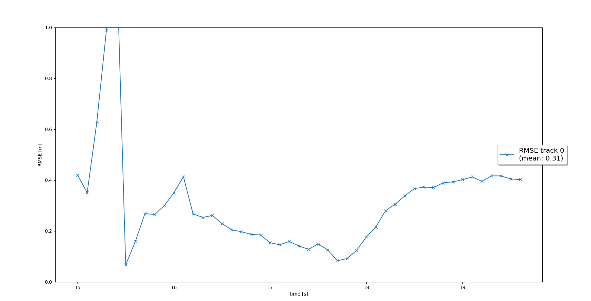
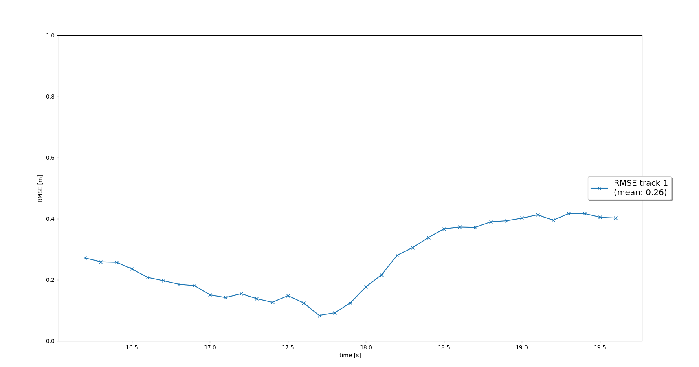
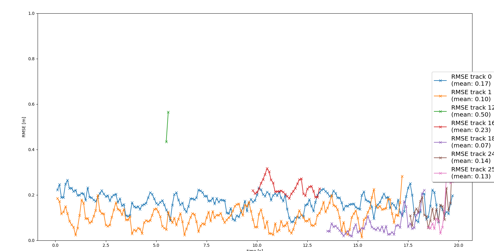
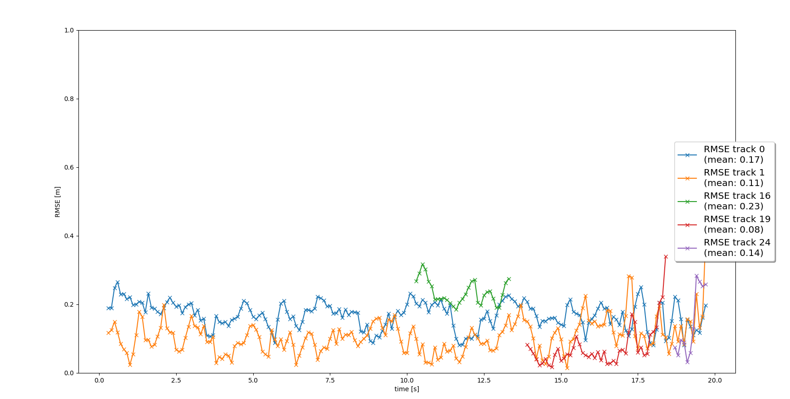

## 1. Write a short recap of the four tracking steps and what you implemented there (filter, track management, association, camera fusion). Which results did you achieve? Which part of the project was most difficult for you to complete, and why?
## 1.1. Tracking
#### Track objects over time with a Kalman Filter
Here we have implemented Kalman filter. 
At the beginning of tracking there were outlier. 
Another way of initialization is necessary.

RMSE


## 1.2. Track Management
#### Initialize, update and delete tracks

Track object start use states. In the first 5 frames we do not compare RMSE. Mean rmse were decreased.



## 1.3. Data Association
#### Associate measurements to tracks with nearest neighbor association
Using association matrix give us opportunity follow several objects and match them with measurements.


## 1.4. Sensor Fusion
#### SWBAT fuse measurements from lidar and camera
Here we start using two sensors. 
Count of measurements in one second were increased. 
Confirmed objects were increased too. Some of them quickly disappeared. 
For avoid it I increase window for confirmed.

windows 12


Most difficult part was send solution.  I had a problem:
```You are not enrolled in a nanodegree that contains this project.```

## 2. Do you see any benefits in camera-lidar fusion compared to lidar-only tracking (in theory and in your concrete results)?

More objects were detected with 2 sensors.

## 3. Which challenges will a sensor fusion system face in real-life scenarios? Did you see any of these challenges in the project?

Some sensors may found more ghost objects. 

### 4. Can you think of ways to improve your tracking results in the future?
Sensors have different zones. 
We should ignore objects which out current sensor zone.
