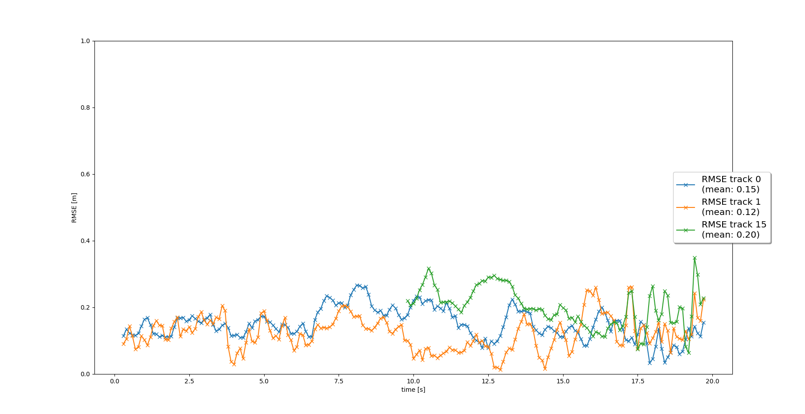

## 1. Tracking
#### Track objects over time with a Kalman Filter
Here we have implemented Kalman filter. 
At the beginning of tracking there were outlier. 
Another way of initialization is necessary.

RMSE

## 2. Track Management
#### Initialize, update and delete tracks

Track object start use states. In the first 5 frames we do not compare RMSE. Mean rmse were decreased.

## 3. Data Association
#### Associate measurements to tracks with nearest neighbor association
Using association matrix give us opportunity follow several objects and match them with measurements.

## 4. Sensor Fusion
#### SWBAT fuse measurements from lidar and camera
Here we start using two sensors. 
Count of measurements in one second were increased. 
Confirmed objects were increased too. Some of them quickly disappeared. 
For avoid it I increase window for confirmed.

windows 12
