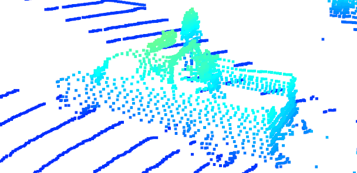

## 1. Compute Lidar Point-Cloud from Range Image
### 1.1. Visualize range image channels (ID_S1_EX1)


### 1.2. Visualize point-cloud (ID_S1_EX2)

Within a write-up file (Markdown or PDF):
* Find 10 examples of vehicles with varying degrees of visibility in the point-cloud




* Try to identify vehicle features that appear stable in most of the inspected examples and describe them 
Cars have some kind of shadow on the road. Because they are big obstacles.
Windows and wheels are visible on most cars. Lidar beams pass through the windows. Wheels protrude from the car body.  

## 2. Create Birds-Eye View from Lidar PCL
### 2.1. Convert sensor coordinates to bev-map coordinates (ID_S2_EX1)

### 2.2. Compute intensity layer of bev-map (_ID_S2_EX2_)

### 2.3. Compute height layer of bev-map (ID_S2_EX3)


## 3.Model-based Object Detection in BEV Image
### 3.1. Add a second model from a GitHub repo (ID_S3_EX1)
### 3.2. Extract 3D bounding boxes from model response (ID_S3_EX2)


## 4.Performance Evaluation for Object Detection
### 4.1. Compute intersection-over-union (IOU) between labels and detections (ID_S4_EX1)
### 4.2. Compute false-negatives and false-positives (ID_S4_EX2)
### 4.3. Compute precision and recall (ID_S4_EX3)
For resnet 
```buildoutcfg
all_positives 306.0, true_positives 218.0, false_negatives 88.0, false_positives 1.0
precision = 0.7124183006535948, recall = 0.7124183006535948
```
