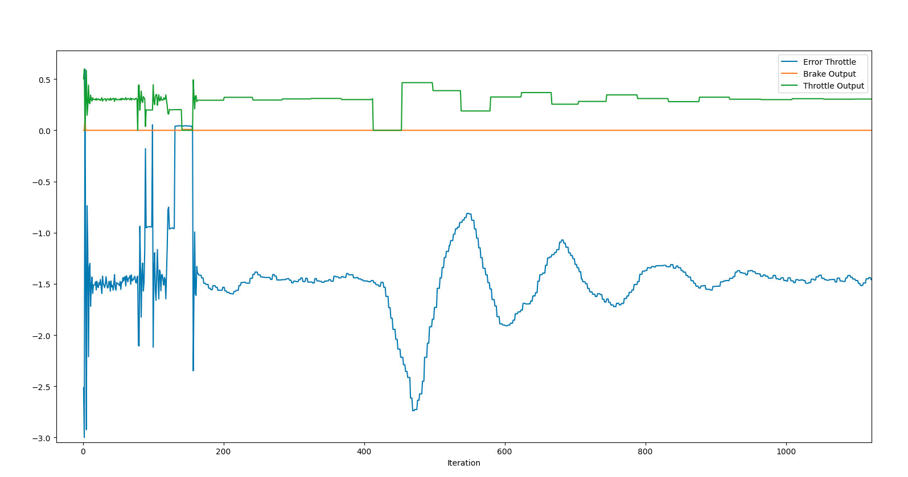
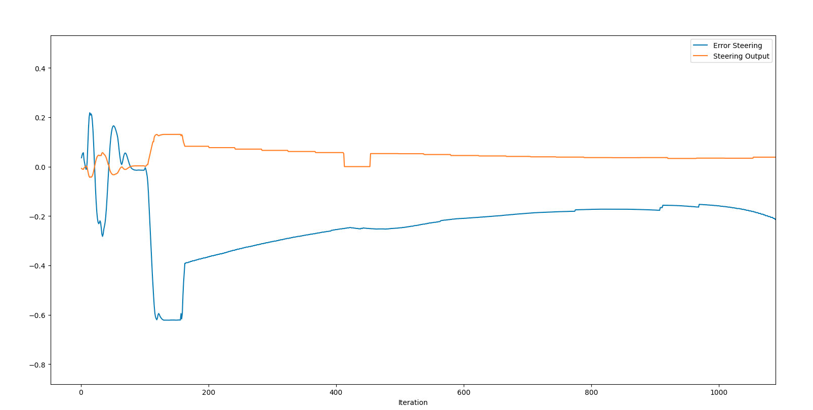

[comment]: <> (// Answer the following questions:)

### Preparation.
For more simple controller I change [simulatorAPI.py](../simulatorAPI.py).
Before that changes `yaw` was direction of first waypoint. 
In my solution I required ego car direction from localization.

After that, reach corner of the street became easier.

[comment]: <> (// Add the plots to your report and explain them &#40;describe what you see&#41;)
### Plots.

This version of Pid controller have stable error, which is almost constant to both controllers.
I think with some bias it can be more robust.

[comment]: <> (// What is the effect of the PID according to the plots, how each part of the PID affects the control command?)

### PID components.
For not perfect trajectory P components in both controllers were enough.  
In [solution](https://review.udacity.com/#!/reviews/3095222) of previous version PID controller project I use all 3 components

[comment]: <> (// How would you design a way to automatically tune the PID parameters?)

### Auto turning.
In [PIDTRainer](pid_trainer.h) I realize some version of Twiddle. But it did not give awesome improvments. 

[comment]: <> (// PID controller is a model free controller, i.e. it does not use a model of the car. Could you explain the pros and cons of this type of controller?)

### Pros and cons.
#### Pros:
* PID controller is very simple.
* It is not required additional information about car(like mass).

#### Cons:
* Model is not robust

[comment]: <> (// &#40;Optional&#41; What would you do to improve the PID controller?)
#### Pid improvements.
Some throttling needed even when error is zero. 
I think with some bias or constant for velocity it will be more robust. 